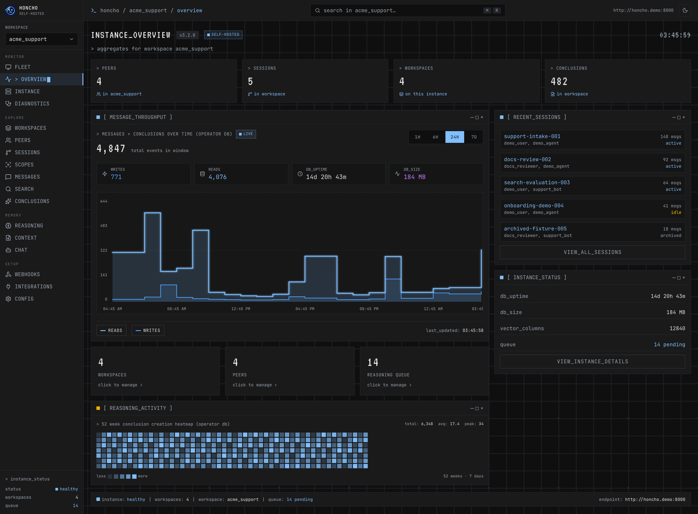
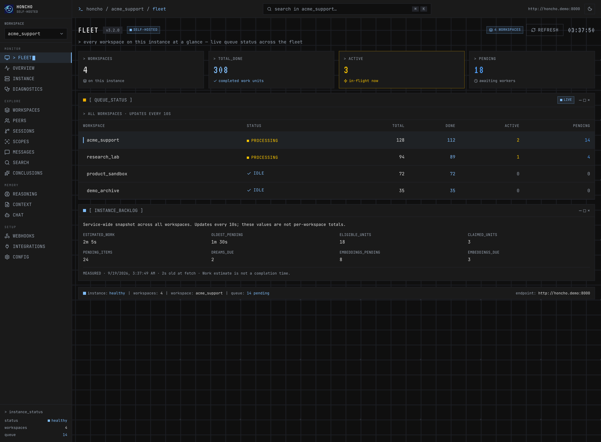
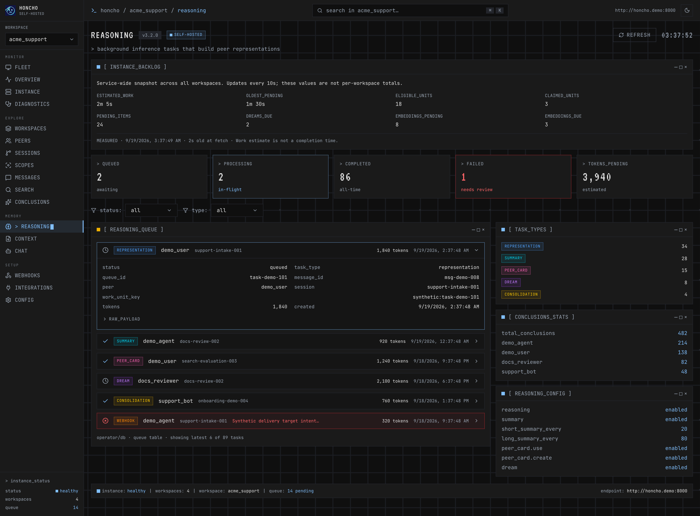
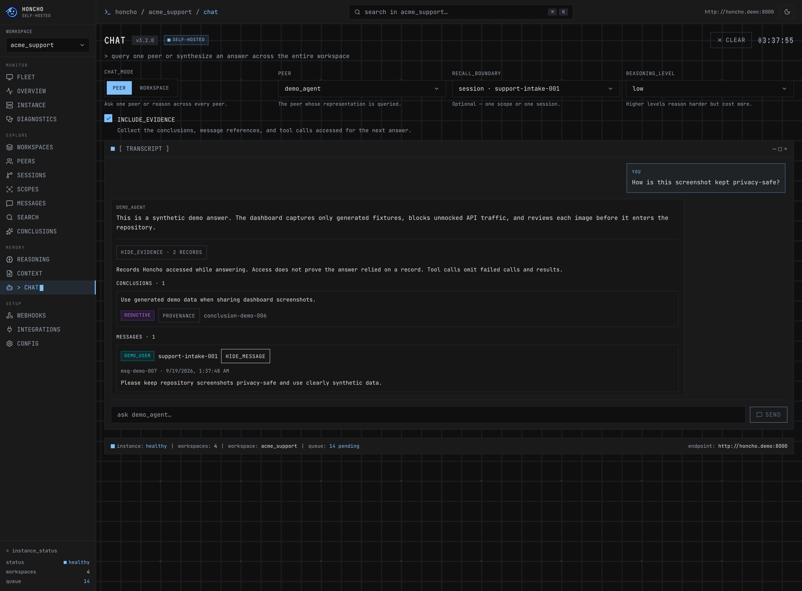
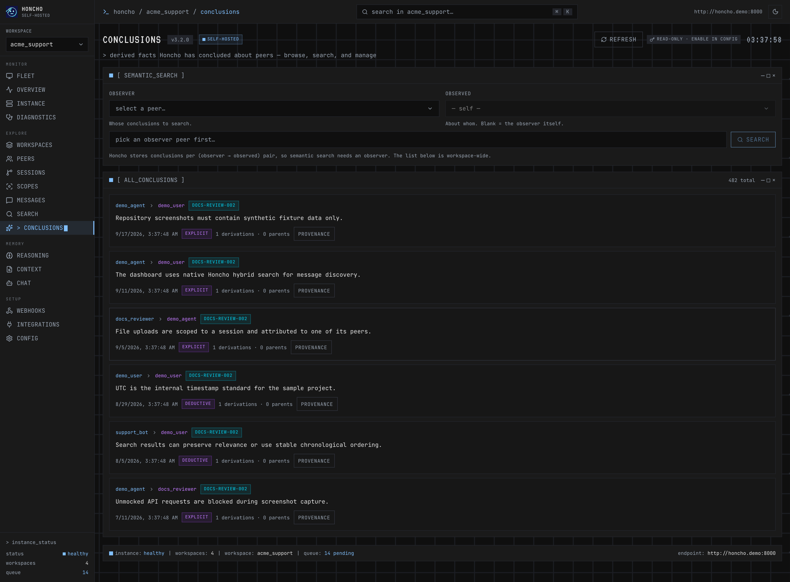
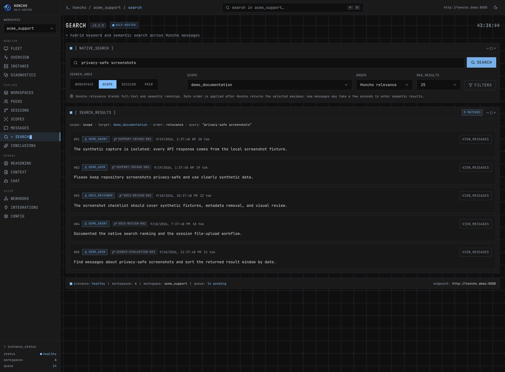
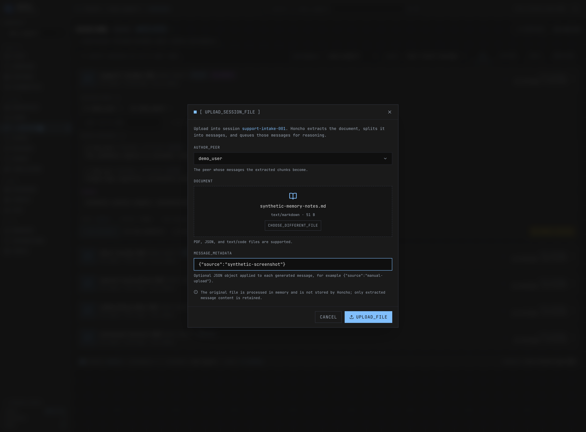

# Honcho Self-Hosted Dashboard

A self-hosted operator dashboard for [Honcho](https://honcho.dev). Built with Next.js 16,
Tailwind CSS v4, Framer Motion, and the official [`@honcho-ai/sdk`](https://www.npmjs.com/package/@honcho-ai/sdk).

The Next.js app lives in [`site/`](./site).



> The dashboard wired to a live Honcho instance, in the dark "Memory Console" theme.
> Every workspace, peer, session, and message shown is synthetic demo data.
> See [`docs/SCREENSHOTS.md`](docs/SCREENSHOTS.md) for the repository's capture and
> privacy checklist.

|  Fleet — cross-workspace queue monitor  |  Reasoning — deriver queue with expandable tasks  |
| :-------------------------------------: | :-----------------------------------------------: |
|                 |                   |

|  Chat — memory-augmented dialectic over a peer  |  Conclusions — browse + semantic search  |
| :---------------------------------------------: | :--------------------------------------: |
|                           |      |

|  Search — native hybrid retrieval + ordering  |  Session upload — attributed document ingestion  |
| :--------------------------------------------: | :------------------------------------------------: |
|                      |           |

## Features

Organized into four sections that mirror the sidebar.

**Monitor** — read-only operator dashboards.

- **Fleet** — every workspace on the instance at a glance, with live deriver-queue status (total / done / active / pending) across the whole fleet, polled every 10s. The default landing screen.
- **Overview** — per-workspace dashboard: peer / session / workspace / conclusion counts, a message-throughput chart (1H / 6H / 24H / 7D), a 52-week conclusion-activity heatmap, recent sessions, and instance status.
- **Instance** — live server state: health, endpoint, workspace age, runtime, database (size, connections, pgvector), vector columns, largest tables, and per-workspace queue status.
- **Diagnostics** — composite health probes (Honcho API + database + operator), a config readout, and a tail of recent server logs.

**Explore**

- **Workspaces** — browse workspaces as cards; create, edit configuration, and delete against the live API.
- **Peers** — filter by id, workspace, and type (user / agent); expand a peer for its session / message / conclusion counts, an editable peer card, its conclusions, and search-within-peer.
- **Sessions** — browse every paginated Honcho session, then search and sort (most recent / oldest message, most / fewest messages, newest / oldest created) and filter by status (active / idle / archived); expand for peers, recent messages, and summaries; clone a session, add / remove peers, or upload PDF / JSON / text documents as messages.
- **Messages** — a read-only cross-session message stream with content search, session and peer filters, and user-vs-agent token stats.
- **Scopes** — create named visibility boundaries, add or remove member sessions, and monitor asynchronous backfill/reconciliation state and copied-document counts. Requires Honcho 3.1.0+ and a workspace- or admin-level key.
- **Search** — Honcho-native hybrid keyword/vector search across a workspace, named scope, session, or peer, with Honcho relevance / newest / oldest ordering plus UTC date, metadata, and result-limit filters.
- **Conclusions** — browse the workspace's derived facts (paginated), run semantic search scoped to an observer→observed pair, and create or delete conclusions.

**Memory**

- **Reasoning** — the deriver queue that builds peer representations: queued / processing / completed / failed tiles, expandable tasks with parsed and raw payloads, a task-type breakdown, and a config readout; filter by status / type, retry failed tasks, or schedule a dream.
- **Context** — assemble LLM-ready context from a peer's card, conclusions, summaries, and messages, with a token budget, per-layer toggles, a live preview, and optional scope-backed representation/card recall.
- **Chat** — memory-augmented dialectic chat with peer and workspace-wide modes, a mutually exclusive session/scope recall boundary, and a chosen reasoning level.

**Setup**

- **Webhooks** — register and remove webhook endpoints, send a test emit, and view delivery activity.
- **Integrations** — reference guides for connecting agents (MCP, Claude Code, and others) to Honcho, with config examples pre-filled with your live endpoint.
- **Config** — manage multiple Honcho connections (stored in `localStorage`), test a connection, switch the active instance, and flip the write-actions master toggle.

**Cross-cutting**

- **Multi-instance** — point the dashboard at several self-hosted Honcho servers and switch between them; optional bearer-token auth.
- **Safe by default** — a master **write-actions** toggle (off by default) hides the create / update / delete controls on the workspace, peer, session, conclusion, reasoning, and webhook screens; each confirms before writing to the live instance. Reads never confirm.
- **Operator DB layer** — richer views (throughput, heatmap, per-session / per-peer stats, webhook deliveries, log tail) come from a read-only operator database connection, and degrade gracefully to the Honcho API when it isn't configured.
- **Resilient UI** — loading / empty / error states on every data path, in a dark "Memory Console" theme.

## Architecture

Three layers, each with a single job:

1. **`@honcho-ai/sdk` — native data flows.**
   Workspaces, peers, sessions, messages, conclusions queries, contexts, chat, queue
   status, dream scheduling, scopes, scope-aware recall, workspace chat, and search use
   the SDK directly. The dashboard currently targets SDK 2.4.x.
   See `site/src/lib/honcho/sdk.ts` for the per-(instance, workspace) client cache.

2. **A thin raw client — only for verified SDK gaps.**
   File: `site/src/lib/honcho/client.ts`. Each raw transport is labeled with its gap reason:
   - `/health`, `/openapi.json` — not in SDK
   - Workspace `list / create / delete` — the SDK is workspace-scoped and
     get-or-creates on first use, which is the wrong UX for management screens
   - Workspace-wide conclusion `list / query / delete` — SDK organizes
     conclusions by `(observer, observed)` peer pair
   - Session file upload — SDK 2.4 multipart requests omit the per-instance
     proxy header, so the raw transport preserves the selected upstream safely
   - One read-only scope-list compatibility probe — deliberately bypasses the
     SDK's workspace get-or-create behavior when version metadata is unavailable
   - Webhook `list / create / delete / test` — no SDK methods

3. **Operator modules — for self-hosted runtime, db, config, logs, diagnostics.**
   `site/src/lib/operator/*` + `site/src/app/api/operator/*` route handlers.
   These are the metrics Honcho's REST API does not expose (uptime, db size,
   pgvector status, throughput timeseries, log tail, etc.). They read the same
   Postgres database Honcho uses **read-only** — Honcho itself is not modified.
   Every module degrades to `{ available: false, reason: ... }` when its
   configuration env var is not set, so the UI renders cleanly without them.

   | Module                  | Env required                  | What it exposes |
   |-------------------------|-------------------------------|-----------------|
   | `runtime`               | none (`HONCHO_RUNTIME_START_TS` optional) | dashboard uptime, Node version, optional Honcho uptime |
   | `db`                    | `HONCHO_DATABASE_URL`         | db size, pgvector status, table sizes, throughput buckets, 52-week heatmap, conclusion stats |
   | `logs`                  | `HONCHO_LOG_FILE`             | tail of Honcho log file (JSON or plain) |
   | `config`                | none                          | safe env-var snapshot (secrets redacted) |
   | `diagnostics`           | combines all of the above     | composite probe with timings and per-category status |

### Request routing

The browser never talks to Honcho directly — every Honcho call goes through the same-origin
proxy at `/api/honcho/[...path]` so there is no CORS dance and so the proxy can enforce a
**server-side allowlist** of upstream Honcho URLs (`HONCHO_PROXY_ALLOWED_BASES`). This applies
to both the SDK and the raw client; SDK `/v3/*` requests are rewritten to the same proxy.

## Quick start (local dev)

```bash
cd site
npm install
cp .env.example .env.local   # set NEXT_PUBLIC_HONCHO_BASE_URL
npm run dev
```

Open <http://localhost:3000>.

## Quick start (Docker)

```bash
cp docker-compose-example.yml docker-compose.yml   # your local copy (gitignored)
cp .env.example .env                               # set your Honcho URL + (optional) DB
docker compose up -d                               # pulls ghcr.io/outpoints/honcho-dashboard
```

The template pulls the prebuilt image from GHCR — update later with
`docker compose pull && docker compose up -d`. To build from source instead, uncomment
the `build:` block in the Compose file and run `docker compose up --build`.

On first run, open the dashboard and point it at your Honcho server under **CONFIG** —
the prebuilt image ships with a `http://localhost:8000` default baked in (the active
instance is chosen in-app and stored per browser). Set `HONCHO_PROXY_ALLOWED_BASES` to
include that URL so the same-origin proxy will forward to it. Building from source with
`HONCHO_BASE_URL` set instead bakes your instance in as the default.

A `docker-compose-example.yml` template is included at the repo root. Copy it to
`docker-compose.yml` (which is gitignored, so your local edits stay local). To wire the
operator modules, set these in the environment that runs Compose:

```bash
HONCHO_BASE_URL=http://honcho:8000              # base URL the dashboard proxies to
HONCHO_DATABASE_URL=postgresql://...            # read-only Postgres DSN (operator/db)
HONCHO_LOG_FILE=/var/log/honcho/honcho.log      # mounted in container (operator/logs)
HONCHO_RUNTIME_START_TS=2026-05-22T00:00:00Z    # optional, lets us report Honcho uptime
HONCHO_PROXY_ALLOWED_BASES=http://honcho:8000   # multi-instance allowlist
```

The dashboard container exposes port `3000`. If you co-locate it with Honcho on the same
Docker network, the proxy can talk to Honcho via the internal service name.

## Repo layout

```
.
├── site/                       # Next.js application
│   ├── src/
│   │   ├── app/
│   │   │   ├── api/honcho/[...path]/route.ts   # same-origin proxy w/ allowlist
│   │   │   └── api/operator/{runtime,db,config,logs,diagnostics}/route.ts
│   │   ├── components/         # AppShell + pages
│   │   ├── lib/
│   │   │   ├── honcho/         # sdk.ts, client.ts (gaps), adapters.ts, config.ts, useQuery.ts
│   │   │   └── operator/       # runtime.ts, db.ts, logs.ts, config.ts, diagnostics.ts, client.ts
│   │   └── types/honcho.ts
│   ├── docs/research/          # BEHAVIORS / COLOR_AUDIT / DROPDOWN specs
│   ├── Dockerfile              # multi-stage build (node:24-alpine, standalone output)
│   ├── .env.example
│   └── package.json
├── docker-compose-example.yml  # template → copy to docker-compose.yml (gitignored)
├── docs/                        # PII-free product screenshots + capture policy
├── CLAUDE.md
├── .github/workflows/          # CI runs inside site/
└── LICENSE                     # GPL-3.0
```

## Scripts (run inside `site/`)

| Command             | Description                |
| ------------------- | -------------------------- |
| `npm run dev`       | Start the dev server       |
| `npm run build`     | Production build           |
| `npm run capture:screenshots` | Capture the synthetic README image set |
| `npm run start`     | Run the production build   |
| `npm run lint`      | ESLint                     |
| `npm run test`      | Focused Node tests         |
| `npm run typecheck` | TypeScript check (no emit) |
| `npm run check`     | lint + typecheck + test + build |

## Stack

- **Next.js 16** (App Router, React 19, TypeScript strict, standalone output)
- **`@honcho-ai/sdk`** v2.4 for native Honcho data flows
- **`pg`** for the read-only operator DB connection
- **Tailwind CSS v4** with custom `@theme` tokens
- **Framer Motion** for entrance / hover / tap / layout animations
- **Lucide React** icons
- **JetBrains Mono** + **VT323** fonts via `next/font/google`

## Routes

Hash-based router inside `AppShell`, in sidebar order: `#/fleet`, `#/overview`, `#/instance`,
`#/diagnostics`, `#/workspaces`, `#/peers`, `#/sessions`, `#/scopes`, `#/messages`, `#/search`, `#/conclusions`,
`#/reasoning`, `#/context`, `#/chat`, `#/webhooks`, `#/integrations`, `#/config`.
`#/fleet` is the default landing route.

## Honcho version compatibility

The dashboard preserves its established workspace, peer, session, message,
conclusion, search, peer-chat, and unscoped-context flows on Honcho 3.0.x.
Features introduced by Honcho 3.1 are capability-gated:

- Dashboard 1.1.1 uses `@honcho-ai/sdk` 2.4.0 and has been exercised end to
  end against a live self-hosted Honcho 3.1.0 instance, including search, chat,
  context assembly, scope membership, and scope backfill/reconciliation.
- A parseable `/openapi.json` version is authoritative. Known pre-3.1 servers
  receive no scope or workspace-chat requests; those controls show a clear
  `Requires Honcho 3.1+` state instead.
- If an instance omits or customizes its version metadata, the dashboard makes
  one read-only scope-list probe for the active workspace. `404` / `405` means
  unsupported, while `401` / `403` means the server supports scopes but the
  active key needs workspace- or admin-level access.
- Network failures and other ambiguous responses fail conservatively: 3.1-only
  controls remain disabled without affecting older dashboard workflows.

## Known quirks

- **Peer rows query the DB per row on expand.** Each peer card lazy-loads its
  message count, conclusion count, and conclusion list with one
  `operator/db` query when the row expands — and peer rows default to expanded.
  This is fine for the typical workspace (a handful of peers), but a workspace
  with hundreds of peers will issue that many queries on load. If you point the
  dashboard at such a workspace, switch to a batched page-level query
  (`GROUP BY` peer) like `dbSessionStats` does.
- **Operator panels degrade without a DB connection.** Metrics Honcho's REST
  API doesn't expose — throughput chart, 52-week heatmap, db size/uptime,
  per-session message/token counts, per-task reasoning records, webhook
  delivery history, and per-peer message/conclusion stats — come from the
  read-only `HONCHO_DATABASE_URL` operator layer. Without it those panels show
  an "operator DB unavailable" state; everything backed by the SDK still works.
- **`conclusions` is not a physical table.** Honcho's REST `conclusions`
  resource is stored in the `documents` table; conclusion *type* is the `level`
  column (`explicit` / `deductive` / `inductive` / `contradiction`) and *frequency*
  is `times_derived`. Operator queries probe `documents` (falling back to
  `conclusions`) and adapt to `*_name` vs `*_id` join columns across Honcho
  versions.
- **Messages have no per-message status.** The original mock UI showed
  `completed` / `skipped` / `processing` chips per message; live Honcho messages
  carry no such field, so the Messages/Sessions views show token counts instead.
  Per-task reasoning status lives in the `queue` table and is surfaced on the
  Reasoning page.
- **Some original controls map to features Honcho doesn't expose.** Session
  *archive*, webhook *per-event filters* / per-endpoint failure counts, and the
  reasoning *pause / process-all* buttons have no public API, so they were
  dropped rather than faked. Webhook endpoints are registered by URL only.

## Changelog

### 1.1.1 — 2026-08-28

**Added**

- Honcho 3.1 scope management with paginated session membership, asynchronous backfill status, and safe add/remove controls.
- Named-scope search, scope-aware context inspection, and peer/workspace chat with mutually exclusive session or scope recall boundaries.
- Workspace-wide chat for cross-peer questions and synthesis.

**Changed**

- Upgraded `@honcho-ai/sdk` to 2.4.0 and migrated scopes, scoped search/context, peer scope recall, and workspace chat from raw routes to the SDK's native APIs.
- Added shared Honcho capability detection so known pre-3.1 servers never receive scope or workspace-chat requests; upgrade, permission, and unknown-version states now preserve all established workflows with explicit guidance.

**Compatibility**

- Scope management, named-scope recall, and workspace-wide chat require Honcho 3.1.0+; established browsing, peer chat, search, and unscoped context workflows remain available on older servers.
- Creating scopes or changing their session membership requires a workspace- or admin-level key and the dashboard's write-actions toggle.

**Known limitation**

- Honcho does not currently expose an API for deleting an entire scope. The dashboard can create scopes and add or remove all member sessions, but an obsolete empty scope cannot yet be removed.

### 1.1.0 — 2026-08-25

**Added**

- Honcho-native hybrid message search across workspace, session, and peer scopes, including relevance / chronological ordering plus UTC date and metadata filters.
- Session-scoped PDF, JSON, text, and code-file upload with peer attribution and optional message metadata.
- A fail-closed Playwright capture workflow and refreshed repository screenshots built entirely from synthetic fixtures.

**Changed**

- Upgraded `@honcho-ai/sdk` to 2.3 and aligned the raw conclusion-query adapter with the current Honcho v3 request and response shapes.
- Session, message, chat, and context pickers request newest-first data. Search keeps Honcho's native hybrid ranking for relevance and applies stable chronological ordering within the returned result window for newest / oldest.
- The header search field and `Cmd/Ctrl+K` shortcut now open the dedicated native Search screen.

**Fixed**

- Loaded every page from Honcho's paginated session list so search, filtering, and sorting are no longer limited to the first 100 sessions ([#9](https://github.com/outpoints/honcho-dashboard/issues/9)).
- Suppressed placeholder values such as `unknown` so the page header never renders `vunknown` when an instance omits its OpenAPI version.
- Preserved the selected session when **VIEW_MESSAGES** navigates from Sessions to Messages.
- Made the 52-week activity heatmap render exactly 364 UTC days ending on the current UTC day, eliminating future-looking empty cells.
- Stopped the Honcho proxy from forwarding undefined, null, or empty query values and prevented negative PostgreSQL row estimates ([#8](https://github.com/outpoints/honcho-dashboard/pull/8)).

### 1.0.0 — 2026-06-05

First stable release — a self-hosted operator dashboard wired end-to-end to a
live Honcho `v3` instance (no more mock data).

**Added**

- **Live Honcho v3 integration** across workspaces, peers, sessions, messages,
  conclusions, context, and memory-augmented chat — via the official
  [`@honcho-ai/sdk`](https://www.npmjs.com/package/@honcho-ai/sdk), a thin raw
  client for endpoints the SDK doesn't cover, and read-only Postgres *operator
  modules* for metrics the REST API doesn't expose.
- **Fleet** — cross-workspace queue monitor as the default landing page.
- **Reasoning** — deriver-queue view with expandable tasks, retry, parsed
  payloads, and status-tile filtering, backed by direct `queue` table queries.
- **Light / dark theme toggle** — "Memory Console" (dark) and "Paper Terminal"
  (light), with the dark palette matched to [honcho.dev](https://honcho.dev).
- **Operator surfaces** — Overview throughput + heatmap, Instance stats,
  Diagnostics, and workspace / peer / config editor modals.
- Reactive browser tab title, portal-anchored dropdowns, and a binding design
  guide for the visual system.
- **Deployment** — Docker Compose stack and a GHCR multi-arch release workflow
  triggered on `vX.Y.Z` tags.

**Fixed**

- The header version badge now reads the real Honcho version from the connected
  instance (`/openapi.json` → `info.version`) instead of a hardcoded value
  ([#4](https://github.com/outpoints/honcho-dashboard/issues/4)).

### 0.1.0

- Initial scaffold — the polished UI shell with mock data.

## Credits

- **Design inspiration** — the dashboard's initial visual direction was
  inspired by **nodaylight's** Honcho dashboard demo at
  <https://honcho-dashboard-gamma.vercel.app/>. This repository is an
  independent implementation that has since expanded with its own architecture,
  operator tooling, and feature set.
- **[`@honcho-ai/sdk`](https://www.npmjs.com/package/@honcho-ai/sdk)** — the
  official TypeScript SDK from the Honcho team powers every native data flow
  in this dashboard (workspaces, peers, sessions, scopes, messages, contexts,
  chat, queue, search, and dream scheduling). The thin raw client at
  `site/src/lib/honcho/client.ts` is only used for endpoints the SDK doesn't
  cover (health, `/openapi.json`, workspace create/list/delete, workspace-wide
  conclusions, webhooks, and the side-effect-free compatibility probe) or
  cannot safely route through the selected-instance proxy (multipart session
  uploads in SDK 2.4).
- **[Honcho](https://honcho.dev)** — the self-hosted memory server this is
  a dashboard for.

## License

GPL-3.0
